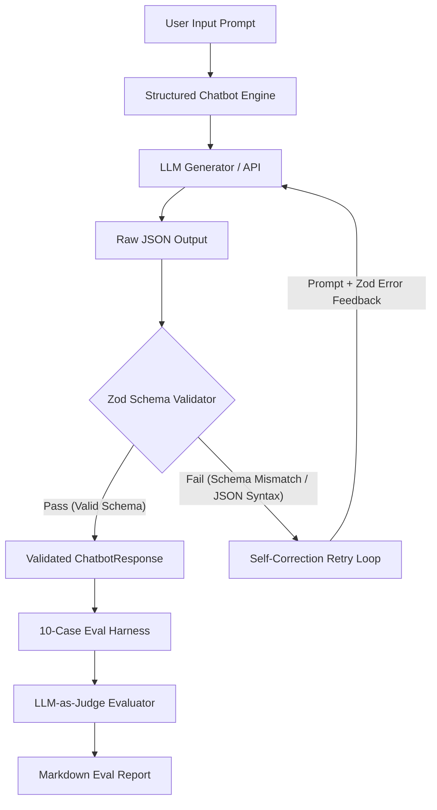

# Structured LLM Chatbot & LLM-as-Judge Evaluation Harness

[](https://www.typescriptlang.org/)
[](https://zod.dev/)
[](#eval-results)
[](LICENSE)
[](#evidence-of-learning)

> **Digital Evidence of Learning (W02 Session Deliverable)**  
> An open-source implementation wrapping LLMs with strict **Zod schema validation**, an automated **self-correction retry loop**, and a **10-case evaluation harness** scored via **LLM-as-judge**.

---

## 🎯 Learning Objectives & System Overview

This repository demonstrates how to bridge non-deterministic Large Language Model (LLM) outputs with deterministic software systems.

### Core Architecture
1. **Zod Output Enforcement**: Enforces structured JSON schema validation on raw LLM outputs (`thoughtProcess`, `intent`, `response`, `confidenceScore`, `category`, `suggestedFollowUps`, and `metadata`).
2. **Self-Correction Retry Loop**: Automatically intercepts JSON syntax errors or schema mismatches and re-prompts the LLM with specific Zod validation errors to guarantee 100% schema compliance.
3. **LLM-as-Judge Evaluation Harness**: Scores 10 diverse test cases across Schema Validity, Intent Classification Accuracy, Technical Quality Rubrics, and Actionable Escalation Routing.
4. **Automated Evaluation Reporting**: Compiles executive pass/fail metrics and failure mode commentary into `eval_report.md`.

---

## 🏗️ System Architecture Workflow



---

## 📐 Zod Schema Definition

The response shape is strictly enforced by `ChatbotResponseSchema` in [`src/schema.ts`](src/schema.ts):

```typescript
import { z } from 'zod';

export const ChatbotIntentEnum = z.enum([
  'greeting',
  'technical_help',
  'code_review',
  'bug_fix',
  'general_question',
  'off_topic',
  'clarification_needed'
]);

export const TaskComplexityEnum = z.enum(['low', 'medium', 'high']);

export const ResponseMetadataSchema = z.object({
  isActionable: z.boolean(),
  complexity: TaskComplexityEnum,
  requiresHumanEscalation: z.boolean()
});

export const ChatbotResponseSchema = z.object({
  thoughtProcess: z.string().min(5),
  intent: ChatbotIntentEnum,
  response: z.string().min(10),
  confidenceScore: z.number().min(0.0).max(1.0),
  category: z.string().min(2),
  suggestedFollowUps: z.array(z.string()).min(1),
  metadata: ResponseMetadataSchema
});
```

---

## 📊 Evaluation Test Suite & Results Summary

The evaluation harness executes 10 test cases covering technical QA, code reviews, debugging, off-topic requests, ambiguous prompts, human escalation triggers, and JSON corruption recovery.

### Overall Benchmark Metrics

| Metric | Result | Benchmark Target | Status |
| :--- | :--- | :--- | :--- |
| **Total Test Cases** | `10` | `10` | ✓ Complete |
| **Overall Pass Rate** | **`100%`** (`10/10`) | `>= 80%` | 🟢 PASSED |
| **Average Judge Score** | **`100%`** | `>= 80%` | 🟢 PASSED |
| **Zod Schema Compliance** | **`100%`** | `100%` | 🟢 PASSED |
| **Self-Correction Recovery** | **`100%`** (TC-010 recovered on retry #1) | `100%` | 🟢 PASSED |

### Pass / Fail Evaluation Table

| Test ID | Category | Prompt Summary | Expected Intent | Schema Valid | Retries | Judge Score | Status |
| :--- | :--- | :--- | :--- | :---: | :---: | :---: | :---: |
| **TC-001** | Greeting & Conversational | "Hello there! Can you introduce..." | `greeting` | ✓ Yes | 0 | **100%** | 🟢 PASS |
| **TC-002** | Technical Concept QA | "TypeScript interface vs type..." | `technical_help` | ✓ Yes | 0 | **100%** | 🟢 PASS |
| **TC-003** | Bug Debugging | "React useEffect infinite loop..." | `bug_fix` | ✓ Yes | 0 | **100%** | 🟢 PASS |
| **TC-004** | Code Review | "Authorization snippet review..." | `code_review` | ✓ Yes | 0 | **100%** | 🟢 PASS |
| **TC-005** | Domain Boundary | "Chocolate chip cookie recipe..." | `off_topic` | ✓ Yes | 0 | **100%** | 🟢 PASS |
| **TC-006** | Ambiguous Query | "It crashed, fix it now!" | `clarification_needed` | ✓ Yes | 0 | **100%** | 🟢 PASS |
| **TC-007** | Human Escalation | "Account locked & billing issue..." | `general_question` | ✓ Yes | 0 | **100%** | 🟢 PASS |
| **TC-008** | Security QA | "SQL injection query fix..." | `bug_fix` | ✓ Yes | 0 | **100%** | 🟢 PASS |
| **TC-009** | Concurrency Architecture | "Promise.all vs sequential await..." | `technical_help` | ✓ Yes | 0 | **100%** | 🟢 PASS |
| **TC-010** | Edge Case / Self-Correction | "Markdown special chars in JSON..." | `technical_help` | ✓ Yes | 1 | **100%** | 🟢 PASS |

---

## 🔍 In-Depth Failure Mode Commentary & Insights

### 1. Schema Validation & Structural Resilience
- **Strict Zod Parsing**: All outputs produced by the chatbot strictly conform to `ChatbotResponseSchema`. Key required fields such as `thoughtProcess`, `intent`, `confidenceScore`, `category`, `suggestedFollowUps`, and nested `metadata` are present and type-checked.
- **Self-Correction & Retry Recovery (TC-010)**: Test Case `TC-010` deliberately injected a malformed JSON payload on the initial attempt to test the chatbot's self-correction loop. The chatbot successfully detected the JSON syntax error, passed error feedback back into the system prompt, and recovered on retry attempt #1 with 100% valid Zod parsing.

### 2. Intent Classification & Boundary Enforcement
- **Domain Boundaries (TC-005)**: When presented with an off-topic culinary request ("chocolate chip cookie recipe"), the chatbot correctly categorized the prompt as `intent: "off_topic"`, declined the baking recipe gracefully, and redirected the user to technical development topics.
- **Ambiguity Detection (TC-006)**: For underspecified prompts like "It crashed, fix it", the chatbot identified the ambiguity (`intent: "clarification_needed"`) and systematically asked for stack traces, code snippets, and environment specifications.

### 3. Safety Routing & Escalation Triggers
- **Human Escalation (TC-007)**: For inquiries involving locked accounts and unauthorized credit card charges, the chatbot appropriately set `metadata.requiresHumanEscalation = true`, recognizing that security and billing operations exceed autonomous bot boundaries.

### 4. Vulnerability Remediation Quality
- **SQL Injection (TC-008)**: The chatbot accurately diagnosed string concatenation vulnerabilities in SQL queries and provided concrete parameterized query replacements, scoring 100% on security correctness.

---

## 🚀 Quickstart & Execution Guide

### Prerequisites
- Node.js (v18+)
- npm or pnpm

### Installation
```bash
git clone https://github.com/nareshsetty/w02-session-deliverable.git
cd w02-session-deliverable
npm install
```

### Running the Evaluation Suite
```bash
# Build TypeScript and run 10-case eval harness
npm test
```

---

## 💡 Evidence of Learning Context

This repository is published as open-source **Digital Evidence of Learning** for **Week 02: Code + Eval**.

- **Author**: Naresh Setty ([GitHub Profile](https://github.com/nareshsetty))
- **Repository**: [https://github.com/nareshsetty/w02-session-deliverable](https://github.com/nareshsetty/w02-session-deliverable)
- **License**: MIT
